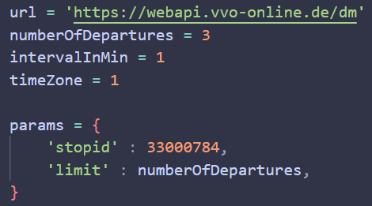

# VVOScraper

A little script, that fetches all interesting data about one station from the VVO api to analyse/visualize it. 

## Fetch Data

To initialize the database, run 'initializeDatabase.py'. Set the interval (between api requests), number of upcoming departures fetched per request and the end time of the schedule loop in 'scraper.py': 

|         |        |
| ------- | ------ |
| numberOfDepartures | amount of upcoming connections the data is fetched for |
| intervalInMin | interval in minutes in which the requests are made |
| timeZone | Integer, offset to the UTC timezone (0 for UTC+00:00, 1 for UTC+01:00, ...) |
| stopId | Id of the station you want to analyse (to get the id go to https://www.vvo-online.de/de/fahrplan/fahrplanauskunft/ and search for connections from your stop. The stop id can be found in the url after 'originid=') |

If you want to learn more about the VVO api, you can find more information in this [documentation](https://github.com/kiliankoe/vvo/blob/main/documentation/webapi.md)

Set the end time (hour 0-23, minutes, seconds) of the schedule loop in the repeat decorator:

## Analyse Data

To analyse the fetched data, run 'analysis.py'. The charts will be saved in the 'Charts' folder.

If showPlots is set to True, every plot will be shown in a seperate matplotlib window. If savePlot is set to True, the plots will be safed in the specified path. Set the type and path for the files in the script:

If you don't want all of the plots to be saved/shown, comment out the according functions in main()

## Ideas for the future:

- [ ] analyse delay development over time
- [ ] dynamic spacing of plots
- [ ] run multiple requests in parallel (fetch data for multiple stations at once)
- [ ] add encryption for data
